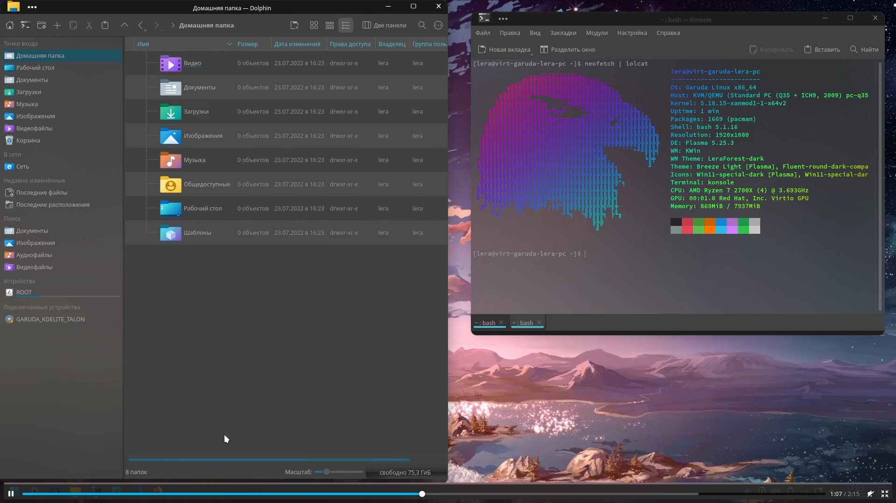

# linux-post-install

Настройка ОС, доустановка программ, перенос профиля пользователя

Работает на Garuda Linux (из опробованных множеств дистрибутивов, этот мне нравится больше всего для десктопа).

[Full on youtube](https://www.youtube.com/watch?v=Bs1gLrFPDyI)
